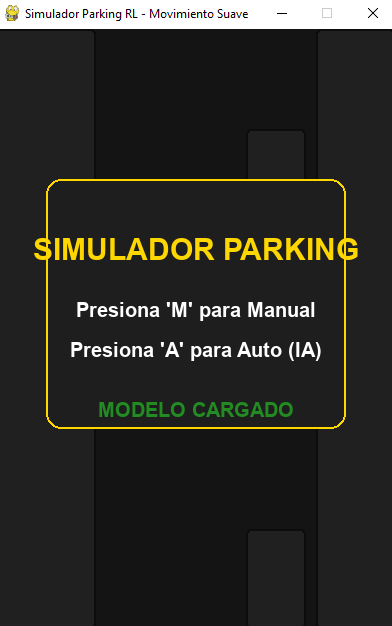
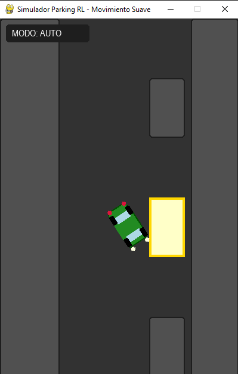
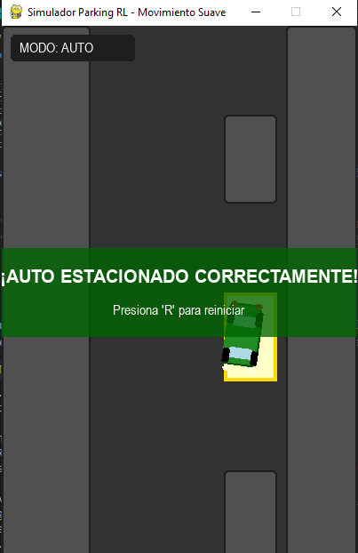

# Parking Simulator with Reinforcement Learning


> Un simulador de estacionamiento autónomo impulsado por Q-Learning y física cinemática.

<div align="center">
  
  
  
</div>

## Descripción

Este proyecto implementa un entorno de simulación de estacionamiento en 2D utilizando **Python** y **Pygame**. El núcleo del proyecto es un agente de **Aprendizaje por Refuerzo (Q-Learning)** que aprende a estacionar un vehículo de manera autónoma, evitando obstáculos y maniobrando en espacios reducidos.

El simulador incluye un modelo físico de "bicicleta" (bicycle model) para simular el movimiento realista de un coche, incluyendo aceleración, frenado y dirección no holonómica.

## Características Principales

*   **Agente Inteligente:** Entrenado con Q-Learning para resolver el problema de estacionamiento.
*   **Modo Manual:** Toma el control y prueba tus habilidades de conducción.
*   **Física Realista:** Implementación de cinemática vehicular (aceleración, fricción, radio de giro).
*   **Gráficos Dinámicos:** Luces de freno y faros, suavizado de movimiento (interpolación) y visualización clara.
*   **Entrenamiento Personalizable:** Scripts incluidos para re-entrenar al agente con diferentes parámetros.

## Instalación

Sigue estos pasos para configurar el proyecto en tu máquina local:

1.  **Clonar el repositorio:**
    ```bash
    git clone https://github.com/brandsrx/parking_simulator.git
    cd parking_simulator
    ```

2.  **Crear un entorno virtual (Opcional pero recomendado):**
    ```bash
    # Windows
    python -m venv venv
    venv\Scripts\activate

    # Linux/Mac
    python3 -m venv venv
    source venv/bin/activate
    ```

3.  **Instalar dependencias:**
    ```bash
    pip install pygame numpy
    ```

## Uso

### 1. Ejecutar el Simulador (Inferencia/Juego)
Para ver al agente en acción o conducir manualmente:

```bash
python simulator.py
```

**Controles:**
| Tecla | Acción |
| :--- | :--- |
| `M` | **Modo Manual**: Tú controlas el auto. |
| `A` | **Modo Auto**: La IA toma el control. |
| `R` | **Reset**: Reinicia el episodio actual. |
| `ESC` | **Menú**: Vuelve a la pantalla de inicio. |
| `⬆️` / `⬇️` | Acelerar / Frenar (Reversa). |
| `⬅️` / `➡️` | Girar volante. |

### 2. Entrenar al Agente
Para iniciar un nuevo proceso de entrenamiento:

```bash
python train.py
```
*Esto generará un archivo `modelo_parking.pkl` con la nueva tabla Q.*

## Detalles Técnicos (Q-Learning)

El agente toma decisiones basadas en una **Tabla Q** que mapea Estados a Acciones.

### Espacio de Estados (State Space)
El estado se define por una tupla de 3 valores discretizados:
1.  **`dx`**: Distancia horizontal relativa al objetivo.
2.  **`dy`**: Distancia vertical relativa al objetivo.
3.  **`angle`**: Ángulo del vehículo relativo a la vertical.

### Espacio de Acciones (Action Space)
El agente puede tomar 7 acciones discretas en cada paso:
*   `0`: No hacer nada (Inercia/Fricción).
*   `1`: Acelerar adelante.
*   `2`: Acelerar atrás.
*   `3`: Adelante + Derecha.
*   `4`: Adelante + Izquierda.
*   `5`: Atrás + Derecha.
*   `6`: Atrás + Izquierda.

### Función de Recompensa (Reward Function)
*   **+1000**: Estacionamiento exitoso (dentro del recuadro y alineado).
*   **-100**: Colisión con obstáculos o límites.
*   **-1**: Penalización por paso de tiempo (incentiva rapidez).
*   **Shaping**: Recompensa continua basada en la reducción de la distancia al objetivo.

## Estructura del Proyecto

```text
parking-simulator/
├── simulator.py              # Interfaz gráfica y bucle principal (Pygame)
├── parking_env_cinematico.py # Lógica del entorno, física y recompensas
├── q_learning_agent.py       # Clase del agente Q-Learning (algoritmo)
├── train.py                  # Script de entrenamiento headless (sin GUI)
├── modelo_parking.pkl        # Modelo entrenado (guardado)
└── README.md                 # Documentación
```

## Roadmap y Mejoras Futuras

*   [ ] Implementar Deep Q-Networks (DQN) para estados continuos.
*   [ ] Añadir sensores tipo Lidar (Raycasting) para detección de obstáculos.
*   [ ] Generación aleatoria de escenarios de estacionamiento.
*   [ ] Soporte para estacionamiento en paralelo.

## Contribuciones

¡Las contribuciones son bienvenidas! Si tienes ideas para mejorar la física o el algoritmo, no dudes en abrir un Pull Request.

## Licencia

Este proyecto está bajo la Licencia MIT - mira el archivo [LICENSE](LICENSE) para más detalles.
